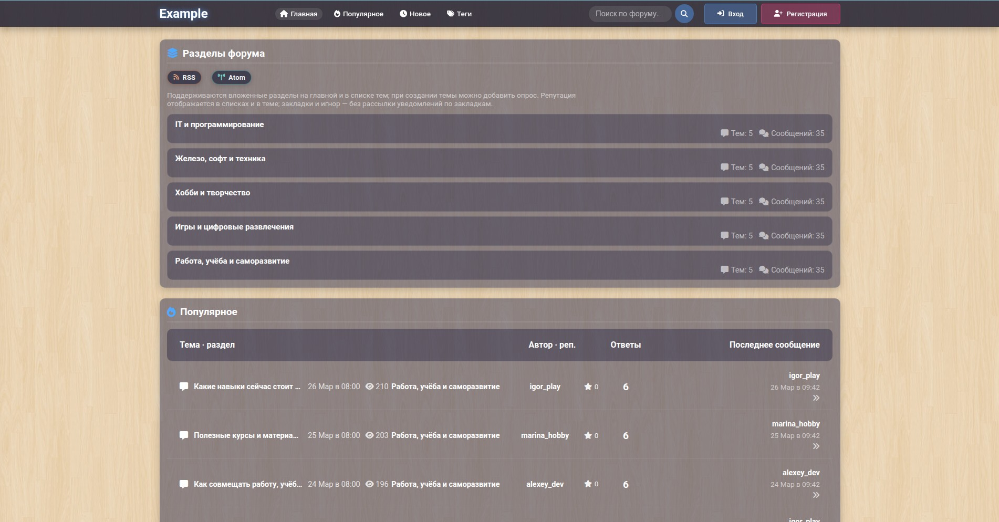
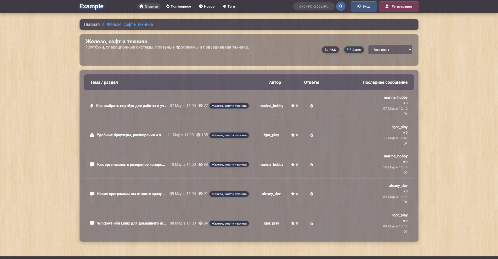
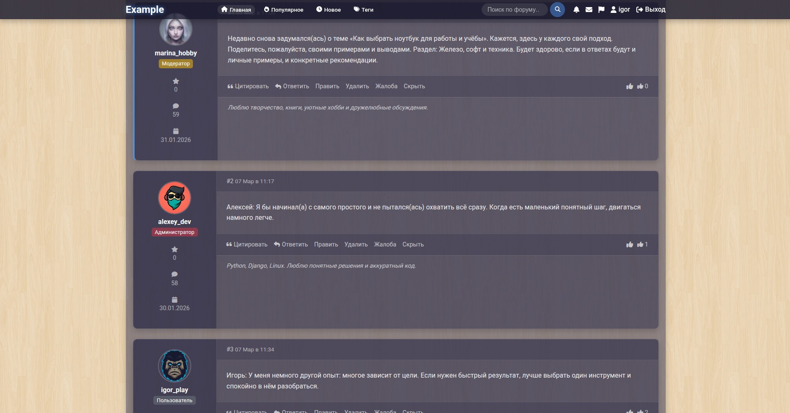
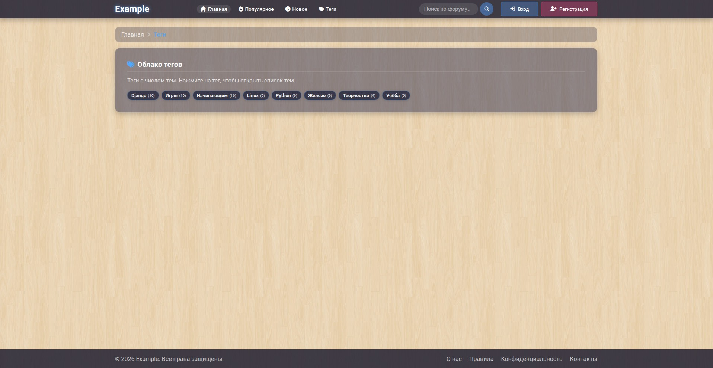
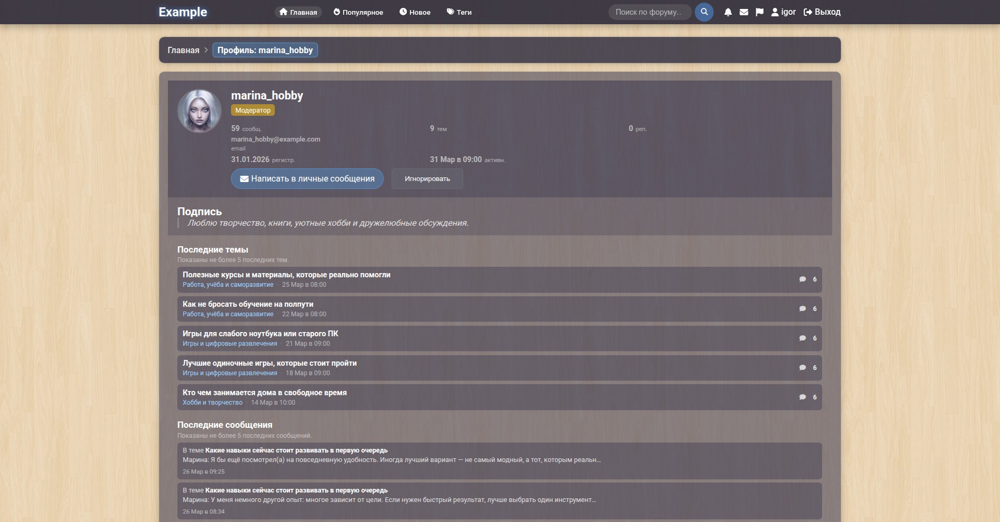
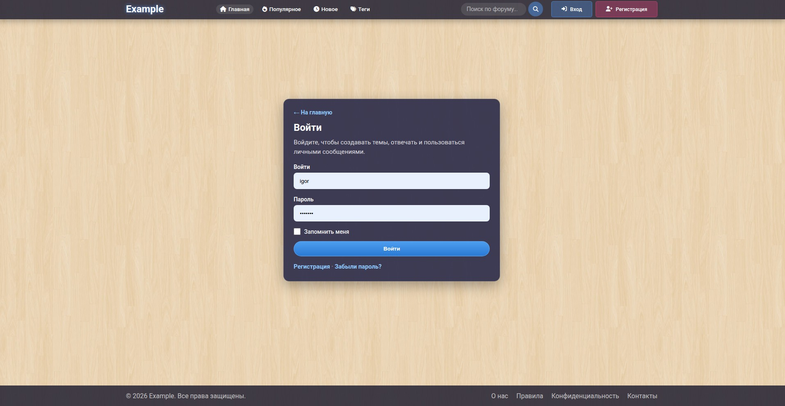
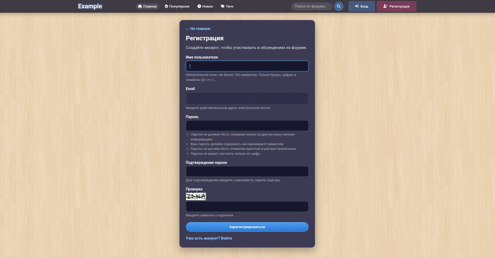
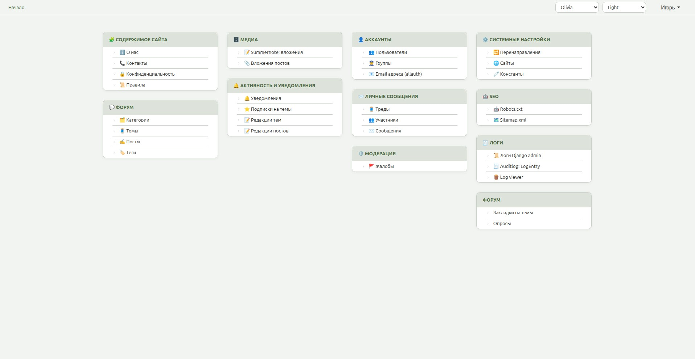
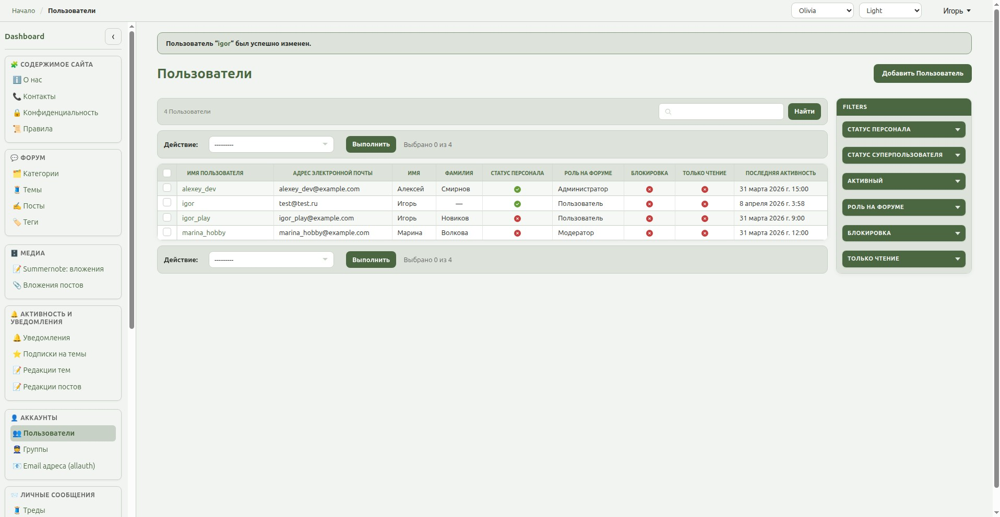
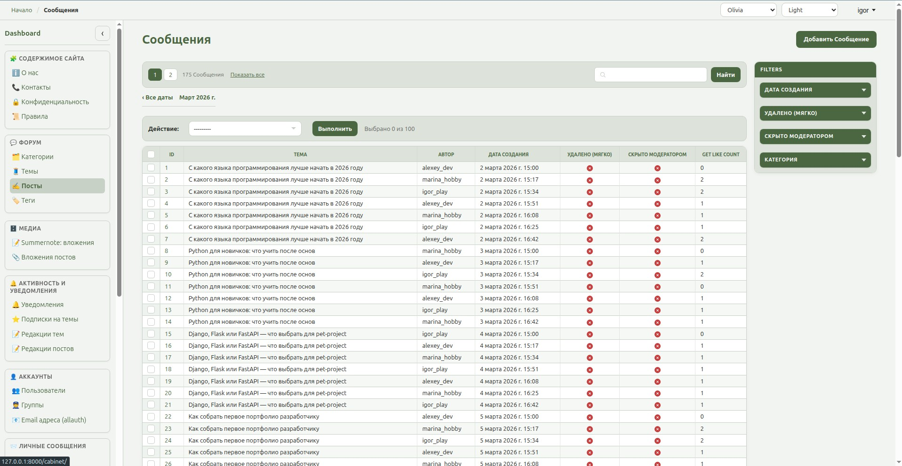

# django-forum

Классический веб-форум на **Django 6**: категории и **подфорумы** (дерево разделов), темы со slug, ответы, вложения, лайки и **репутация (karma)**, поиск (PostgreSQL / MySQL FULLTEXT или упрощённый режим), подписки на темы, **закладки без уведомлений**, **игнор пользователей** (фильтр лент, поиска, ЛС), **опросы в теме**, @упоминания, уведомления, личные сообщения, жалобы и модерация, теги тем и облако тегов. Опционально **Redis** для кэша Django и счётчика «онлайн». Вход и регистрация через **django-allauth**.

## Скриншоты

### Главная страница



### Раздел: список тем



### Тема с ответами



### Теги



### Профиль пользователя



### Вход и регистрация





### Админка







## Быстрый старт

```bash
cp env.example .env    # SECRET_KEY и при необходимости переменные БД / Redis
make install           # uv sync
make migrate
make createsuperuser
make run               # http://127.0.0.1:8000/
```

Демо-данные форума (опционально):

```bash
make fixtures
```

## Команды Makefile

| Цель | Назначение |
|------|------------|
| `make install` | `uv sync` — зависимости |
| `make migrate` | `makemigrations` + `migrate` (`core.settings.development`) |
| `make migrate-prod` | `makemigrations` + `migrate` (`core.settings.production`) |
| `make run` | Сервер разработки |
| `make test` | Тесты `apps.forum` и `apps.site_pages` |
| `make fixtures` | Загрузка `fixtures/forum_demo.json` |
| `make to-req` | Экспорт зависимостей в `requirements.txt` |

## Структура проекта

```text
django-forum/
├── apps/
│   ├── users/                 # кастомная модель User (роли, бан, игнор, karma)
│   ├── forum/                 # форум: models, views, forms, feeds (RSS/Atom)
│   │   ├── migrations/
│   │   ├── services/        # уведомления, presence (Redis), антиспам, …
│   │   ├── templates/forum/ # темы, списки, профиль, ЛС, закладки, опросы
│   │   ├── templatetags/
│   │   └── tests/
│   ├── about/, contacts/, privacy/, rules/, robots/, site_pages/, sitemap/
├── core/
│   ├── settings/
│   │   ├── base.py          # INSTALLED_APPS, MIDDLEWARE, include(components/…)
│   │   ├── development.py
│   │   ├── production.py
│   │   └── components/
│   │       ├── database/    # sqlite/postgresql/mysql + redis (кэш, .env каждой СУБД отдельно)
│   │       ├── performance/ # caches.py (CACHE_URL / locmem), compression.py
│   │       ├── authentication/
│   │       ├── security/
│   │       ├── admin_tools/ # constance, auditlog, …
│   │       └── …
│   ├── middlewares/
│   └── urls.py              # cabinet, accounts, forum, …
├── templates/               # общие шаблоны (base, аккаунт)
├── fixtures/forum_demo.json
├── manage.py
├── pyproject.toml
└── Makefile
```

Админка: **http://127.0.0.1:8000/cabinet/** (маршруты в `core/urls.py`).

## База данных

Какая СУБД используется, задаётся **в модуле настроек**, а не одной переменной в `.env`:

| Режим | Файл настроек | Подключаемый конфиг БД |
|--------|----------------|-------------------------|
| Разработка (по умолчанию в `manage.py`) | [`development.py`](core/settings/development.py) | [`sqlite.py`](core/settings/components/database/sqlite.py) |
| Продакшен | [`production.py`](core/settings/production.py) | вручную один из `postgresql.py` / `mysql.py` (см. комментарии в файле) |

Переменные в `.env` для каждого движка:

| Движок | Файл | Переменные |
|--------|------|------------|
| SQLite | [`sqlite.py`](core/settings/components/database/sqlite.py) | `DB_SQLITE_NAME`, `DB_SQLITE_PATH` |
| PostgreSQL | [`postgresql.py`](core/settings/components/database/postgresql.py) | `DB_POSTGRES_*` |
| MySQL | [`mysql.py`](core/settings/components/database/mysql.py) | `DB_MYSQL_*` |

Полнотекстовый поиск на MySQL и PostgreSQL зависит от движка БД; логика в [`apps/forum/search.py`](apps/forum/search.py). Для MySQL FULLTEXT-индексы на соответствующих полях задаются вручную на стороне БД (в миграциях проекта они не создаются).

## Redis (кэш и «онлайн»)

Настройки в [`core/settings/components/database/redis.py`](core/settings/components/database/redis.py) подключаются **после** [`components/performance/caches.py`](core/settings/components/performance/caches.py), чтобы при `REDIS_URL` переопределить `CACHES["default"]` без потери `CACHE_KEY_PREFIX` / `CACHE_TIMEOUT`. Онлайн-присутствие в форуме (`apps/forum/services/presence.py`) использует тот же `REDIS_URL`.

Переменные окружения (см. также `env.example`): `REDIS_URL`, `FORUM_PRESENCE_TTL`, `FORUM_LAST_ACTIVITY_DB_SYNC_SECONDS`, опционально лимиты пула `REDIS_CACHE_MAX_CONNECTIONS`, таймауты `REDIS_CACHE_SOCKET_TIMEOUT_SEC`, `REDIS_CACHE_SOCKET_CONNECT_TIMEOUT_SEC`.

## Возможности форума (кратко)

- **Подфорумы:** родитель у `Category`, список тем по поддереву, хлебные крошки и метка раздела в таблицах тем.
- **Закладки:** `/profile/bookmarks/`, кнопки в теме; без подписки на уведомления.
- **Игнор:** список в `/profile/ignored/`, кнопка в чужом профиле; скрытие в лентах, поиске, постах темы, ЛС.
- **Репутация:** поле `karma`, начисление при лайках чужих постов; отображение в списках тем и в теме.
- **Опросы:** при создании темы (вопрос + варианты построчно), голосование и блок результатов в теме.
- **RSS/Atom:** `/feeds/latest/`, `/feeds/category/<slug>/` и варианты `.atom`.

## Теги тем

- При создании и редактировании темы — поле «Теги через запятую» (до 8 тегов).
- URL: `/tags/` (облако), `/tags/<slug>/` (список тем).
- На главной — блок «Популярные теги».
